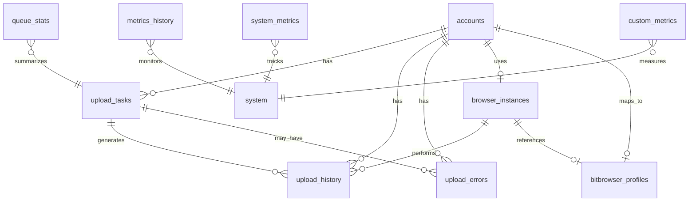

# YouTube Matrix 数据库架构文档

## 概述

YouTube Matrix 系统使用 PostgreSQL 作为主数据库，设计用于管理 YouTube 账户、上传任务、浏览器实例以及相关的监控和分析数据。数据库架构遵循关系型设计原则，通过外键约束确保数据完整性。

## 核心表结构

### 1. accounts（账户表）

**用途**：存储 YouTube 账户信息及其配置。

| 字段 | 类型 | 描述 |
|------|------|------|
| id | UUID | 主键，自动生成 |
| email | VARCHAR(255) | YouTube 账户邮箱，唯一 |
| encrypted_credentials | TEXT | 加密的账户凭证 |
| browser_profile_id | VARCHAR(255) | 浏览器配置文件ID，唯一 |
| status | VARCHAR(50) | 账户状态：active/limited/suspended/error |
| daily_upload_count | INTEGER | 当日上传计数 |
| daily_upload_limit | INTEGER | 每日上传限制，默认2 |
| last_upload_time | TIMESTAMP | 最后上传时间 |
| health_score | INTEGER | 健康分数 (0-100) |
| metadata | JSONB | 额外元数据 |
| bitbrowser_window_id | VARCHAR(255) | BitBrowser窗口ID |
| bitbrowser_window_name | VARCHAR(255) | BitBrowser窗口名称 |
| is_window_logged_in | BOOLEAN | 窗口是否已登录 |
| created_at | TIMESTAMP | 创建时间 |
| updated_at | TIMESTAMP | 更新时间 |

### 2. upload_tasks（上传任务表）

**用途**：管理视频上传任务队列。

| 字段 | 类型 | 描述 |
|------|------|------|
| id | UUID | 主键，自动生成 |
| account_id | UUID | 关联账户ID（外键） |
| video_data | JSONB | 视频信息（标题、描述等） |
| priority | INTEGER | 优先级 (0-10) |
| retry_count | INTEGER | 重试次数 |
| max_retries | INTEGER | 最大重试次数，默认3 |
| status | VARCHAR(50) | 任务状态：pending/active/completed/failed |
| error | TEXT | 错误信息 |
| result | JSONB | 执行结果 |
| created_at | TIMESTAMP | 创建时间 |
| scheduled_for | TIMESTAMP | 计划执行时间 |
| started_at | TIMESTAMP | 开始执行时间 |
| completed_at | TIMESTAMP | 完成时间 |

### 3. browser_instances（浏览器实例表）

**用途**：跟踪和管理浏览器实例状态。

| 字段 | 类型 | 描述 |
|------|------|------|
| id | UUID | 主键，自动生成 |
| window_id | VARCHAR(255) | 窗口ID，唯一 |
| debug_url | VARCHAR(255) | 调试URL |
| status | VARCHAR(50) | 状态：idle/busy/error |
| account_id | UUID | 当前使用的账户ID（外键） |
| error_count | INTEGER | 错误计数 |
| upload_count | INTEGER | 上传计数 |
| last_activity | TIMESTAMP | 最后活动时间 |
| is_persistent | BOOLEAN | 是否持久化窗口 |
| window_name | VARCHAR(255) | 窗口名称 |
| last_health_check | TIMESTAMP | 最后健康检查时间 |
| created_at | TIMESTAMP | 创建时间 |

### 4. upload_history（上传历史表）

**用途**：记录所有上传操作的历史记录。

| 字段 | 类型 | 描述 |
|------|------|------|
| id | UUID | 主键，自动生成 |
| task_id | UUID | 任务ID（外键） |
| account_id | UUID | 账户ID（外键） |
| browser_instance_id | UUID | 浏览器实例ID（外键） |
| video_url | TEXT | 上传后的视频URL |
| upload_duration | INTEGER | 上传耗时（秒） |
| success | BOOLEAN | 是否成功 |
| error_details | JSONB | 错误详情 |
| created_at | TIMESTAMP | 创建时间 |

### 5. bitbrowser_profiles（BitBrowser配置表）

**用途**：存储 BitBrowser 窗口配置信息。

| 字段 | 类型 | 描述 |
|------|------|------|
| id | UUID | 主键，自动生成 |
| window_id | VARCHAR(255) | 窗口ID，唯一 |
| window_name | VARCHAR(255) | 窗口名称 |
| debug_url | VARCHAR(255) | 调试URL |
| profile_data | JSONB | 配置数据（代理、UA等） |
| is_logged_in | BOOLEAN | 是否已登录 |
| is_active | BOOLEAN | 是否激活 |
| last_health_check | TIMESTAMP | 最后健康检查时间 |
| created_at | TIMESTAMP | 创建时间 |
| updated_at | TIMESTAMP | 更新时间 |

### 6. upload_errors（上传错误表）

**用途**：详细记录上传过程中的错误信息。

| 字段 | 类型 | 描述 |
|------|------|------|
| id | UUID | 主键，自动生成 |
| task_id | UUID | 任务ID（外键） |
| account_id | UUID | 账户ID（外键） |
| error_category | VARCHAR(100) | 错误类别 |
| error_message | TEXT | 错误消息 |
| error_stack | TEXT | 错误堆栈 |
| created_at | TIMESTAMP | 创建时间 |

### 7. metrics_history（指标历史表）

**用途**：存储时间序列的性能和业务指标数据。

| 字段 | 类型 | 描述 |
|------|------|------|
| id | UUID | 主键，自动生成 |
| timestamp | TIMESTAMP | 指标时间戳 |
| metric_type | VARCHAR(100) | 指标类型 |
| metric_data | JSONB | 指标数据 |
| created_at | TIMESTAMP | 创建时间 |

### 8. system_metrics（系统指标表）

**用途**：记录系统级别的监控指标。

| 字段 | 类型 | 描述 |
|------|------|------|
| id | UUID | 主键，自动生成 |
| metric_type | VARCHAR(50) | 指标类型 |
| metric_value | JSONB | 指标值 |
| created_at | TIMESTAMP | 创建时间 |

### 9. custom_metrics（自定义指标表）

**用途**：存储自定义的业务指标。

| 字段 | 类型 | 描述 |
|------|------|------|
| id | UUID | 主键，自动生成 |
| name | VARCHAR(255) | 指标名称 |
| value | NUMERIC | 指标值 |
| timestamp | TIMESTAMP | 时间戳 |
| labels | JSONB | 标签信息 |
| created_at | TIMESTAMP | 创建时间 |

### 10. queue_stats（队列统计表）

**用途**：存储任务队列的统计信息。

| 字段 | 类型 | 描述 |
|------|------|------|
| id | UUID | 主键，自动生成 |
| status | VARCHAR(50) | 队列状态 |
| count | INTEGER | 任务数量 |
| avg_age_seconds | NUMERIC | 平均等待时间（秒） |
| min_priority | INTEGER | 最小优先级 |
| max_priority | INTEGER | 最大优先级 |
| created_at | TIMESTAMP | 创建时间 |

## 视图

### 1. account_health_summary

**用途**：提供账户健康状态的汇总视图。

**字段**：
- 账户基本信息（id, email, status, health_score）
- 上传统计（daily_upload_count, daily_upload_limit）
- 24小时成功/失败上传数
- 24小时成功率

### 2. task_queue_status

**用途**：实时显示任务队列状态。

**字段**：
- status：队列状态（queued/processing）
- count：任务数量
- avg_age_seconds：平均等待时间
- min_priority/max_priority：优先级范围

### 3. account_window_mapping

**用途**：展示账户与浏览器窗口的映射关系。

**字段**：
- 账户信息（account_id, email, account_status）
- 窗口信息（window_id, window_name, debug_url）
- 状态信息（is_window_logged_in, window_active, instance_status）

## 表关系图

## 索引优化

系统创建了以下索引以优化查询性能：

### accounts 表索引
- `idx_accounts_status`：状态查询优化
- `idx_accounts_health_score`：健康分数排序
- `idx_accounts_daily_upload_count`：上传计数查询
- `idx_accounts_bitbrowser_window_id`：窗口ID查询
- `idx_accounts_bitbrowser_window_name`：窗口名称查询

### upload_tasks 表索引
- `idx_upload_tasks_status`：任务状态过滤
- `idx_upload_tasks_priority`：优先级排序（降序）
- `idx_upload_tasks_scheduled_for`：计划时间查询
- `idx_upload_tasks_account_id`：账户任务查询

### 其他重要索引
- 时间戳索引：所有表的 `created_at` 字段都有索引
- 外键索引：所有外键关系都创建了索引
- 复合索引：`metrics_history` 表有 `(metric_type, timestamp)` 复合索引

## 触发器和函数

### 1. update_updated_at_column()
自动更新 `updated_at` 时间戳的触发器函数，应用于：
- accounts 表
- bitbrowser_profiles 表

### 2. reset_daily_upload_counts()
重置所有账户的每日上传计数，通常在每日凌晨执行。

## 数据生命周期

1. **账户创建**：在 accounts 表中创建记录，分配 browser_profile_id
2. **窗口映射**：将账户与 BitBrowser 窗口关联
3. **任务创建**：在 upload_tasks 表中创建上传任务
4. **任务执行**：
   - 更新 browser_instances 状态
   - 记录执行过程到 upload_history
   - 出错时记录到 upload_errors
5. **指标收集**：
   - 实时指标写入 system_metrics
   - 历史数据归档到 metrics_history
   - 自定义指标存入 custom_metrics
6. **健康监控**：定期更新 health_score 和 last_health_check

## 最佳实践

1. **事务处理**：所有相关操作应在事务中执行，确保数据一致性
2. **软删除**：重要数据不直接删除，通过状态字段标记
3. **JSONB 使用**：灵活存储结构化数据，支持索引和查询
4. **时间戳管理**：使用触发器自动维护时间戳字段
5. **索引维护**：定期分析查询模式，优化索引策略